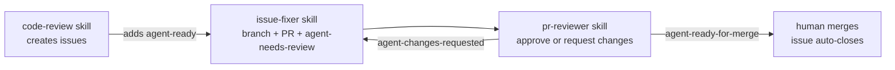
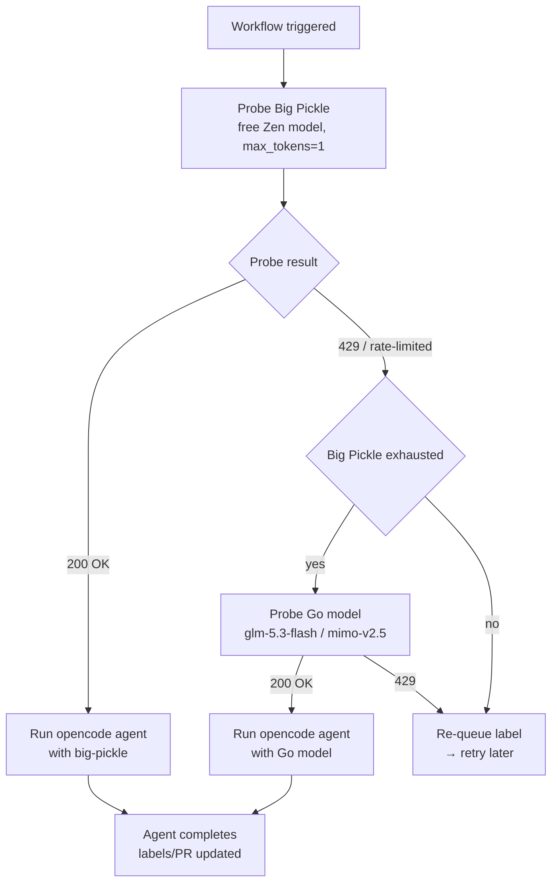
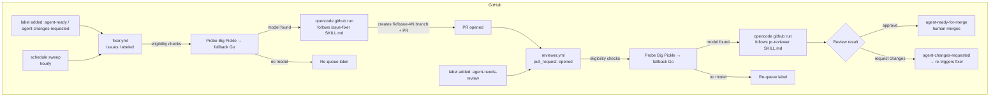

# Plan: Run the Issue Fixer & PR Reviewer as GitHub Actions (opencode + OpenCode Go)

**Status:** Draft for review
**Date:** 2026-09-06
**Goal:** Convert the `.agents/skills/issue-fixer` and `.agents/skills/pr-reviewer` skills into event-driven GitHub Actions workflows, running **opencode** on the runner with the user's **OpenCode Go** subscription key, gated on available usage.

---

## 1. What We're Automating

The current manual loop (run by Copilot in VS Code):



Converting to GitHub Actions means:

1. **Trigger** the fixer when an issue gets the `agent-ready` or `agent-changes-requested` label.
2. **Trigger** the reviewer when an agent PR is created (and re-review after rework).
3. **Run the same skill logic headlessly** — opencode runs inside the GitHub runner, no VS Code, no interactive session.
4. **Keep the skills locally invocable** — the workflows are an optional automation layer; the skills remain the source of truth and can always be run manually (see §10).

## 2. Why opencode + OpenCode Go

- **No Copilot plan needed** — opencode is a free, open-source (MIT) coding agent that runs on the runner itself.
- **OpenCode Go** is a **$10/month subscription** (the user's API key) that gives reliable access to a curated list of open coding models. It's a separate provider from Zen: model IDs use `opencode-go/<model-id>` and endpoints use `https://opencode.ai/zen/go/v1/...`.
- **Public repo friendly** — GitHub's native Copilot cloud agent *automations* are unavailable for public repos, but GitHub Actions + opencode works fine on public repos with free standard runners.
- **`use_github_token: true` mode** — the opencode GitHub action uses the workflow's `GITHUB_TOKEN` directly, so **no GitHub App install and no PAT** are needed.

### About Big Pickle and the Go key

The user asked for **Big Pickle**, but their key is an **OpenCode Go** key. Verified facts:

| Fact | Value |
|---|---|
| Big Pickle is a **Zen free model** | `opencode/big-pickle`, endpoint `https://opencode.ai/zen/v1/chat/completions` — **not** on the Go model list |
| Go model list | Grok 4.6, GPT 5.6 Luna, GLM-5.3-Flash/5.3/5.2/5.1, Kimi K3/K2.7 Code/K2.6, LongCat-2.0, MiMo-V2.5/Pro, MiniMax M3/M2.7, Muse Spark 1.3/1.2 Contributor, Qwen3.8 Max/Flash, Qwen3.7 Max/Plus, Qwen3.6 Plus, DeepSeek V4 Pro/Flash/Vision Exp, Hy4 preview, Hy3, Omen Alpha |
| Same key works for both | The Go key comes from the same account/console as Zen; the docs state *"If you reach the usage limit, you can continue using the free models"* — so the Go key can also hit Zen free models like Big Pickle |
| Go usage limits (documented) | **$12 / 5 hours**, **$30 / week**, **$60 / month** (dollar-value based; e.g. GLM-5.3-Flash ≈ 1,580 req/5h, MiMo-V2.5 ≈ 30,100 req/5h) |
| Usage tracking | Console only — **no public usage/balance API** exists |
| Privacy | Most Go models: zero retention, **not** used for training. Exception: Muse Spark Contributor models (data used for training) — avoid for a public repo. Big Pickle's free period: data may be used to improve the model |

**Recommendation (per user preference):** use **Big Pickle first** — it's free and works well locally — with Go models as the paid fallback:

- **`opencode/big-pickle`** — free Zen model, **primary** for both fixer and reviewer. The Go key works for it too (same account/console).
- **`opencode-go/glm-5.3-flash`** — paid fallback for the fixer (1,580 req/5h, $0.15/$0.50 per 1M tokens, zero retention).
- **`opencode-go/mimo-v2.5`** — paid fallback for the reviewer (30,100 req/5h, cheapest).
- The probe tries Big Pickle first; only if it's rate-limited (429) does it fall back to the Go model. The docs explicitly support using free models alongside Go.

## 3. Usage Gating

**There is no public usage/balance API** — usage is only visible in the Zen/Go console. So gating is a **probe + fallback** strategy: try the free Big Pickle model first (per user preference), and fall back to the paid Go model if Big Pickle is rate-limited.



**Probe step** (shell, before the opencode action):

```yaml
      - name: Check model availability
        id: probe
        env:
          OPENCODE_API_KEY: ${{ secrets.OPENCODE_API_KEY }}
        run: |
          # Try the free Zen model first (Big Pickle)
          code=$(curl -s -o /tmp/probe.json -w "%{http_code}" \
            https://opencode.ai/zen/v1/chat/completions \
            -H "Authorization: Bearer $OPENCODE_API_KEY" \
            -H "Content-Type: application/json" \
            -d '{"model":"big-pickle","messages":[{"role":"user","content":"ping"}],"max_tokens":1}')
          if [ "$code" = "200" ]; then
            echo "model=opencode/big-pickle" >> "$GITHUB_OUTPUT"
            exit 0
          fi
          # Big Pickle rate-limited → fall back to the paid Go model
          code=$(curl -s -o /tmp/probe.json -w "%{http_code}" \
            https://opencode.ai/zen/go/v1/chat/completions \
            -H "Authorization: Bearer $OPENCODE_API_KEY" \
            -H "Content-Type: application/json" \
            -d '{"model":"glm-5.3-flash","messages":[{"role":"user","content":"ping"}],"max_tokens":1}')
          if [ "$code" = "200" ]; then
            echo "model=opencode-go/glm-5.3-flash" >> "$GITHUB_OUTPUT"
            exit 0
          fi
          echo "model=" >> "$GITHUB_OUTPUT"
```

**Gating** — the opencode step only runs when a model was found:

```yaml
      - name: Run opencode (fixer)
        if: steps.probe.outputs.model != ''
        uses: anomalyco/opencode/github@latest
        env:
          OPENCODE_API_KEY: ${{ secrets.OPENCODE_API_KEY }}
          GITHUB_TOKEN: ${{ secrets.GITHUB_TOKEN }}
        with:
          model: ${{ steps.probe.outputs.model }}
          use_github_token: true
          prompt: |
            You are the ARM-Sharp issue fixer. Read .agents/skills/issue-fixer/SKILL.md
            and follow its procedure exactly to fix issue #${{ github.event.issue.number }}.
            Use branch fix/issue-#${{ github.event.issue.number }}, create one PR,
            and manage the label lifecycle (agent-in-progress on pickup,
            agent-needs-review on completion).
```

**If both probes fail** (Big Pickle + Go both exhausted), the workflow re-adds the trigger label so the event fires again later:

```yaml
      - name: Re-queue for later
        if: steps.probe.outputs.model == ''
        env:
          GH_TOKEN: ${{ secrets.GITHUB_TOKEN }}
        run: |
          gh issue edit ${{ github.event.issue.number }} \
            --repo "$GITHUB_REPOSITORY" \
            --add-label "agent-ready" \
            --remove-label "agent-in-progress"
```

**Belt-and-suspenders:** a `schedule`-triggered sweep workflow (e.g., hourly) picks up any leftover `agent-ready` issues that were skipped due to rate limits, so nothing gets stuck.

> **Note on retry timing:** GitHub Actions jobs have a 6-hour max runtime on standard runners. Go's 5-hour window resets frequently, so a re-queue + scheduled sweep is more reliable than sleeping in the job. If you want in-job retries, keep them short (e.g., 3 × 5 min).

## 4. Architecture



Two workflows, one shared label lifecycle, guarded by concurrency groups so only one fixer and one reviewer run at a time.

## 5. Workflow 1: `fixer.yml` — Issue Fixer

**Trigger:** `issues: [labeled]`, filtered to `agent-ready` or `agent-changes-requested`.

**Job steps:**

1. **Eligibility check** (shell, `gh`):
   - Skip if the issue also has `needs-investigation` (matches the skill's "skip unless explicitly requested" rule).
   - Skip if the issue already has `agent-in-progress` / `agent-in-progress-review` (prevents double-pickup).
2. **Probe model availability** (Section 3) — Go model first, Big Pickle fallback.
3. **Run opencode** with the issue-fixer prompt (Section 3).
4. **Re-queue** if no model was available (re-add `agent-ready`).

```yaml
name: Agent Issue Fixer

on:
  issues:
    types: [labeled]

permissions:
  issues: write
  contents: write
  pull-requests: write

concurrency:
  group: agent-fixer
  cancel-in-progress: false

jobs:
  fix:
    if: vars.AGENT_AUTOMATION_ENABLED == 'true' && (github.event.label.name == 'agent-ready' || github.event.label.name == 'agent-changes-requested')
    runs-on: ubuntu-latest
    steps:
      - uses: actions/checkout@v4
        with:
          persist-credentials: false

      - uses: actions/setup-dotnet@v4
        with:
          dotnet-version: 10.0.x

      - name: Eligibility check
        id: check
        env:
          GH_TOKEN: ${{ secrets.GITHUB_TOKEN }}
        run: |
          ISSUE=${{ github.event.issue.number }}
          LABELS=$(gh issue view "$ISSUE" --repo "$GITHUB_REPOSITORY" \
            --json labels --jq '[.labels[].name] | join(",")')
          if echo "$LABELS" | grep -q "needs-investigation"; then
            echo "Skipping: needs-investigation issue"
            echo "eligible=false" >> "$GITHUB_OUTPUT"; exit 0
          fi
          if echo "$LABELS" | grep -qE "agent-in-progress|agent-in-progress-review"; then
            echo "Skipping: already in progress"
            echo "eligible=false" >> "$GITHUB_OUTPUT"; exit 0
          fi
          echo "eligible=true" >> "$GITHUB_OUTPUT"

      - name: Check model availability
        if: steps.check.outputs.eligible == 'true'
        id: probe
        env:
          OPENCODE_API_KEY: ${{ secrets.OPENCODE_API_KEY }}
        run: |
          code=$(curl -s -o /tmp/probe.json -w "%{http_code}" \
            https://opencode.ai/zen/v1/chat/completions \
            -H "Authorization: Bearer $OPENCODE_API_KEY" \
            -H "Content-Type: application/json" \
            -d '{"model":"big-pickle","messages":[{"role":"user","content":"ping"}],"max_tokens":1}')
          if [ "$code" = "200" ]; then
            echo "model=opencode/big-pickle" >> "$GITHUB_OUTPUT"
            exit 0
          fi
          code=$(curl -s -o /tmp/probe.json -w "%{http_code}" \
            https://opencode.ai/zen/go/v1/chat/completions \
            -H "Authorization: Bearer $OPENCODE_API_KEY" \
            -H "Content-Type: application/json" \
            -d '{"model":"glm-5.3-flash","messages":[{"role":"user","content":"ping"}],"max_tokens":1}')
          if [ "$code" = "200" ]; then
            echo "model=opencode-go/glm-5.3-flash" >> "$GITHUB_OUTPUT"
            exit 0
          fi
          echo "model=" >> "$GITHUB_OUTPUT"

      - name: Run opencode (fixer)
        if: steps.check.outputs.eligible == 'true' && steps.probe.outputs.model != ''
        uses: anomalyco/opencode/github@latest
        env:
          OPENCODE_API_KEY: ${{ secrets.OPENCODE_API_KEY }}
          GITHUB_TOKEN: ${{ secrets.GITHUB_TOKEN }}
        with:
          model: ${{ steps.probe.outputs.model }}
          use_github_token: true
          prompt: |
            You are the ARM-Sharp issue fixer. Read .agents/skills/issue-fixer/SKILL.md
            and follow its procedure exactly to fix issue #${{ github.event.issue.number }}.
            Use branch fix/issue-#${{ github.event.issue.number }}, create one PR,
            and manage the label lifecycle (agent-in-progress on pickup,
            agent-needs-review on completion).

      - name: Re-queue for later
        if: steps.check.outputs.eligible == 'true' && steps.probe.outputs.model == ''
        env:
          GH_TOKEN: ${{ secrets.GITHUB_TOKEN }}
        run: |
          gh issue edit ${{ github.event.issue.number }} \
            --repo "$GITHUB_REPOSITORY" \
            --add-label "agent-ready" \
            --remove-label "agent-in-progress"
```

## 6. Workflow 2: `reviewer.yml` — PR Reviewer

**Triggers:**
- `pull_request: [opened, synchronize, ready_for_review]` — the user's requested "review when a PR is created" (filtered to agent PRs).
- `issues: [labeled]` with `agent-needs-review` — the reliable re-review signal after rework (the fixer pushes to the branch *then* adds the label, so the `synchronize` event can race ahead of the label update).

**Job steps:**

1. **Resolve the PR to review**:
   - PR event → use `github.event.pull_request.number`; skip unless `head.ref` starts with `fix/issue-` (or title starts with `fix:`).
   - Issue-label event → find the PR by branch: `gh pr list --head fix/issue-#<issue>`.
2. **Dedup guard**: skip if the PR already has a review submitted by the agent (check `gh pr view --json reviews`), so the two triggers don't double-review.
3. **Probe model availability** (same as fixer).
4. **Run opencode** with the `pr-reviewer` skill prompt (PR number, "never merge", label lifecycle: `agent-ready-for-merge` on approve / `agent-changes-requested` on request-changes).

```yaml
name: Agent PR Reviewer

on:
  pull_request:
    types: [opened, synchronize, ready_for_review]
  issues:
    types: [labeled]

permissions:
  pull-requests: write
  issues: write
  contents: read

concurrency:
  group: agent-reviewer
  cancel-in-progress: false

jobs:
  review:
    if: vars.AGENT_AUTOMATION_ENABLED == 'true'
    runs-on: ubuntu-latest
    steps:
      - uses: actions/checkout@v4
        with:
          persist-credentials: false

      - uses: actions/setup-dotnet@v4
        with:
          dotnet-version: 10.0.x

      - name: Resolve PR to review
        id: pr
        env:
          GH_TOKEN: ${{ secrets.GITHUB_TOKEN }}
        run: |
          if [ "${{ github.event_name }}" = "pull_request" ]; then
            REF="${{ github.event.pull_request.head.ref }}"
            case "$REF" in
              fix/issue-*) echo "pr_number=${{ github.event.pull_request.number }}" >> "$GITHUB_OUTPUT" ;;
              *) echo "Skipping non-agent PR"; echo "pr_number=" >> "$GITHUB_OUTPUT" ;;
            esac
          else
            [ "${{ github.event.label.name }}" = "agent-needs-review" ] || { echo "pr_number=" >> "$GITHUB_OUTPUT"; exit 0; }
            ISSUE=${{ github.event.issue.number }}
            PR=$(gh pr list --repo "$GITHUB_REPOSITORY" --head "fix/issue-#$ISSUE" \
              --json number --jq '.[0].number // empty')
            echo "pr_number=$PR" >> "$GITHUB_OUTPUT"
          fi

      - name: Check model availability
        if: steps.pr.outputs.pr_number != ''
        id: probe
        env:
          OPENCODE_API_KEY: ${{ secrets.OPENCODE_API_KEY }}
        run: |
          code=$(curl -s -o /tmp/probe.json -w "%{http_code}" \
            https://opencode.ai/zen/v1/chat/completions \
            -H "Authorization: Bearer $OPENCODE_API_KEY" \
            -H "Content-Type: application/json" \
            -d '{"model":"big-pickle","messages":[{"role":"user","content":"ping"}],"max_tokens":1}')
          if [ "$code" = "200" ]; then
            echo "model=opencode/big-pickle" >> "$GITHUB_OUTPUT"
            exit 0
          fi
          code=$(curl -s -o /tmp/probe.json -w "%{http_code}" \
            https://opencode.ai/zen/go/v1/chat/completions \
            -H "Authorization: Bearer $OPENCODE_API_KEY" \
            -H "Content-Type: application/json" \
            -d '{"model":"mimo-v2.5","messages":[{"role":"user","content":"ping"}],"max_tokens":1}')
          if [ "$code" = "200" ]; then
            echo "model=opencode-go/mimo-v2.5" >> "$GITHUB_OUTPUT"
            exit 0
          fi
          echo "model=" >> "$GITHUB_OUTPUT"

      - name: Run opencode (reviewer)
        if: steps.pr.outputs.pr_number != '' && steps.probe.outputs.model != ''
        uses: anomalyco/opencode/github@latest
        env:
          OPENCODE_API_KEY: ${{ secrets.OPENCODE_API_KEY }}
          GITHUB_TOKEN: ${{ secrets.GITHUB_TOKEN }}
        with:
          model: ${{ steps.probe.outputs.model }}
          use_github_token: true
          prompt: |
            You are the ARM-Sharp PR reviewer. Read .agents/skills/pr-reviewer/SKILL.md
            and follow it exactly to review PR #${{ steps.pr.outputs.pr_number }}.
            Never merge. Approve (agent-ready-for-merge) or request changes
            (agent-changes-requested) per the skill.
```

## 7. Workflow 3: `sweep.yml` — Scheduled Backstop (optional but recommended)

Picks up `agent-ready` issues that were skipped because both Go and the free tier were exhausted, so the queue never stalls:

```yaml
name: Agent Sweep

on:
  schedule:
    - cron: "0 * * * *"   # hourly

permissions:
  issues: write
  contents: write
  pull-requests: write

concurrency:
  group: agent-fixer
  cancel-in-progress: false

jobs:
  sweep:
    if: vars.AGENT_AUTOMATION_ENABLED == 'true'
    runs-on: ubuntu-latest
    steps:
      - uses: actions/checkout@v4
        with:
          persist-credentials: false

      - uses: actions/setup-dotnet@v4
        with:
          dotnet-version: 10.0.x

      - name: Check model availability
        id: probe
        env:
          OPENCODE_API_KEY: ${{ secrets.OPENCODE_API_KEY }}
        run: |
          code=$(curl -s -o /dev/null -w "%{http_code}" \
            https://opencode.ai/zen/v1/chat/completions \
            -H "Authorization: Bearer $OPENCODE_API_KEY" \
            -H "Content-Type: application/json" \
            -d '{"model":"big-pickle","messages":[{"role":"user","content":"ping"}],"max_tokens":1}')
          if [ "$code" = "200" ]; then
            echo "model=opencode/big-pickle" >> "$GITHUB_OUTPUT"
            exit 0
          fi
          code=$(curl -s -o /dev/null -w "%{http_code}" \
            https://opencode.ai/zen/go/v1/chat/completions \
            -H "Authorization: Bearer $OPENCODE_API_KEY" \
            -H "Content-Type: application/json" \
            -d '{"model":"glm-5.3-flash","messages":[{"role":"user","content":"ping"}],"max_tokens":1}')
          if [ "$code" = "200" ]; then
            echo "model=opencode-go/glm-5.3-flash" >> "$GITHUB_OUTPUT"
            exit 0
          fi
          echo "model=" >> "$GITHUB_OUTPUT"

      - name: Run opencode (sweep)
        if: steps.probe.outputs.model != ''
        uses: anomalyco/opencode/github@latest
        env:
          OPENCODE_API_KEY: ${{ secrets.OPENCODE_API_KEY }}
          GITHUB_TOKEN: ${{ secrets.GITHUB_TOKEN }}
        with:
          model: ${{ steps.probe.outputs.model }}
          use_github_token: true
          prompt: |
            You are the ARM-Sharp issue fixer. Read .agents/skills/issue-fixer/SKILL.md.
            List open issues labeled agent-ready (skip needs-investigation), pick the
            highest-priority one, and fix it following the skill: one branch
            (fix/issue-#N), one PR, label lifecycle (agent-in-progress → agent-needs-review).
```

## 8. Label Lifecycle Integration

The workflows preserve the existing label state machine — no new labels needed:

| Event | Workflow | Action |
|---|---|---|
| `agent-ready` / `agent-changes-requested` added | fixer | pick up, set `agent-in-progress` |
| PR created (branch `fix/issue-#N`) | reviewer | review |
| `agent-needs-review` added to issue | reviewer | (re-)review |
| Reviewer approves | — | issue → `agent-ready-for-merge`; human merges; `Fixes #N` auto-closes |
| Reviewer requests changes | — | issue → `agent-changes-requested` → re-triggers fixer |
| Big Pickle + Go both exhausted | fixer/reviewer | re-queue label; hourly sweep retries |

**Loop safety:**
- The fixer's own label changes (`agent-in-progress`, `agent-needs-review`) never match the fixer's `if` filter, so no self-retrigger.
- `concurrency: group: agent-fixer` (and `agent-reviewer`) serialize runs — one issue at a time, matching the skills' "one issue per branch/PR" rule.
- Eligibility checks skip `needs-investigation` and already-in-progress issues.
- The sweep shares the `agent-fixer` concurrency group, so it can't run concurrently with a label-triggered fixer.
- If an agent run fails mid-way, the issue keeps its current label and no new event fires — no infinite loop; a human re-adds the label to retry.

## 9. Skill Adaptations for Headless Operation

The skills were written for an interactive Copilot session. The opencode prompts must add:

1. **No VS Code** — the "use a read-only subagent (Explore)" step becomes opencode's own file-reading tools; no editor UI.
2. **`gh` CLI is available** — all label/issue/PR commands in the skills work as-is with `GITHUB_TOKEN`.
3. **Branch naming is load-bearing** — the reviewer finds PRs by `fix/issue-#N`; the fixer prompt must insist on the skill's branch convention.
4. **Build/test commands** — `dotnet build ArmRipper.slnx -c Debug` and `dotnet test` run inside the runner (opencode runs in the job, so .NET 10 must be installed first via `actions/setup-dotnet@v4`).
5. **Never merge** — restate the reviewer's safety rule in the prompt.
6. **Permissions** — opencode's default `build` agent has full tool access; the workflow `permissions` block is the real guardrail (issues/contents/pull-requests write, nothing else).
7. **Skills remain the source of truth** — the workflows reference the same `.agents/skills/*/SKILL.md` files, so local runs (Copilot or opencode) and CI runs stay in sync; editing a skill takes effect on the next automated run with no workflow changes.

## 10. Local Invocation & Disabling the Automation

The skills stay the **single source of truth** — the workflows don't duplicate their logic, they just tell opencode to read and follow the same `.agents/skills/*/SKILL.md` files. That means:

- **Local runs keep working** — invoke the skills exactly as today (Copilot in VS Code, or `opencode run` locally with the same prompts). No changes to the skills are required for the automation.
- **Test changes locally first** — edit a skill, run it locally against a test issue/PR, and only then let the workflow pick it up. The workflow always reads the latest skill content from the repo, so a skill edit takes effect on the next automated run automatically.
- **Disabling the automation** — three options, in order of preference:

| Method | How | Effect |
|---|---|---|
| **Repo variable toggle** (recommended) | Set repo variable `AGENT_AUTOMATION_ENABLED` to `false` (Settings → Secrets and variables → Actions → Variables) | All three workflows skip their jobs immediately; no file changes, no commit needed. Set back to `true` to re-enable |
| **GitHub UI** | Actions tab → workflow → ⋯ → Disable workflow | Disables per-workflow; re-enable from the same menu |
| **Remove/rename files** | Delete or rename `.github/workflows/fixer.yml` etc. | Full removal; re-add to re-enable |

The toggle guard is a job-level `if` on every workflow:

```yaml
jobs:
  fix:
    if: vars.AGENT_AUTOMATION_ENABLED == 'true' && (github.event.label.name == 'agent-ready' || github.event.label.name == 'agent-changes-requested')
```

When disabled, the label lifecycle simply pauses — issues keep their current labels and nothing fires. Re-enabling resumes from where it left off (the sweep picks up any `agent-ready` issues).

While the automation is disabled, you can still run the exact same prompts locally with opencode for a 1:1 preview of what the workflow will do:

```bash
opencode run -m opencode/big-pickle \
  "You are the ARM-Sharp issue fixer. Read .agents/skills/issue-fixer/SKILL.md and follow it to fix issue #N..."
```

## 11. Prerequisites

- [ ] **Labels** — all 11 agent labels already exist in the repo (verified). No action needed.
- [ ] **OpenCode Go API key** — from [opencode.ai/auth](https://opencode.ai/auth) (same console as Zen; the Go subscription key). Store as `OPENCODE_API_KEY` in repo → Settings → Secrets and variables → Actions.
- [ ] **No GitHub App / PAT needed** — `use_github_token: true` uses the workflow's `GITHUB_TOKEN`.
- [ ] **.NET 10 on the runner** — `actions/setup-dotnet@v4` with `dotnet-version: 10.0.x` before the opencode step so the agent can build/test.
- [ ] **Model choice** — Big Pickle (`opencode/big-pickle`) is primary; `glm-5.3-flash` (fixer) and `mimo-v2.5` (reviewer) are the paid fallbacks. Confirm all three respond via the probe curl.
- [ ] **Automation toggle** — create repo variable `AGENT_AUTOMATION_ENABLED` = `true` (Settings → Secrets and variables → Actions → Variables). Set to `false` to pause the automation without touching the workflow files.
- [ ] **Branch note** — default branch is `master`; CI currently triggers on `main` (pre-existing inconsistency). The workflows use `master` implicitly via checkout. Consider aligning CI to `master` as a cleanup item.

## 12. Rollout & Testing

1. **Verify the key** — run the probe curl locally; expect HTTP 200 with `big-pickle` (primary) and confirm `glm-5.3-flash` / `mimo-v2.5` also respond (paid fallbacks).
2. **Dry-run opencode** — run `opencode run -m opencode/big-pickle "ping"` locally to confirm the model works (you already use it locally, so this should pass).
3. **Local-first testing** — with `AGENT_AUTOMATION_ENABLED=false`, run the fixer/reviewer prompts locally (Copilot or opencode) against a test issue/PR to validate skill changes before letting the automation run them.
4. **Pilot the fixer** — set `AGENT_AUTOMATION_ENABLED=true`, add `agent-ready` to one low-priority issue (e.g., #176) and watch the workflow.
5. **Pilot the reviewer** — let the fixer's PR trigger the reviewer; verify the review is submitted and labels update.
6. **Exercise the rework loop** — have the reviewer request changes on a trivial point; confirm `agent-changes-requested` re-triggers the fixer and the re-review happens.
7. **Verify no double-reviews** — confirm the dedup guard works when both triggers fire for the same cycle.
8. **Test the gate** — temporarily use a bad key to confirm the probe fails, the job re-queues, and the sweep picks it up later.
9. **Watch the queue** — the 12 open `agent-ready` issues (incl. 3 `needs-investigation` that will be skipped) will drain one at a time.

## 13. Open Questions

1. **Go model choice** — `glm-5.3-flash` and `mimo-v2.5` are the recommended defaults; want different models (e.g., `deepseek-v4-flash` for the fixer)?
2. **Big Pickle privacy caveat** — Big Pickle is primary per your preference, but its free period allows data to be used to improve the model. Since this repo is public, that's worth being aware of; the Go fallback models are zero-retention.
3. **`needs-investigation` issues** — currently skipped by the fixer. Want a separate manual/scheduled workflow for the investigation procedure?
4. **Sweep cadence** — hourly is the default; adjust based on how often Go limits are hit.
5. **CI branch mismatch** — align `ci.yml` triggers to `master`?
6. **opencode version pinning** — `@latest` tracks releases; consider pinning to a specific tag for reproducibility.

## 14. Files to Create

| File | Purpose |
|---|---|
| `.github/workflows/fixer.yml` | Issue fixer (label-triggered, probe-gated, toggle-guarded) |
| `.github/workflows/reviewer.yml` | PR reviewer (PR-created + re-review, probe-gated, toggle-guarded) |
| `.github/workflows/sweep.yml` | Hourly backstop for rate-limited/skipped issues (toggle-guarded) |
| Repo variable `AGENT_AUTOMATION_ENABLED` | Master toggle — `false` pauses all agent workflows (no file changes) |
| `docs/PLAN-GITHUB-ACTIONS-AGENTS.md` | This plan |
| `docs/PLAN-GITHUB-ACTIONS-AGENTS.md` | This plan |